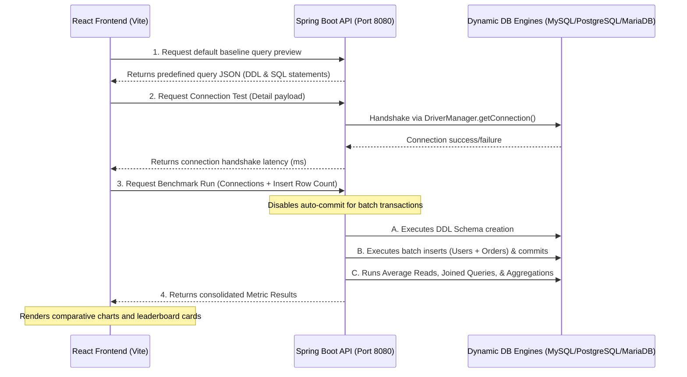

# Database Benchmarking & Performance Analyzer

A full-stack performance analysis dashboard that evaluates and compares connection latencies, schema definition speeds, bulk insertion rates, and query execution times across **MySQL**, **PostgreSQL**, and **MariaDB** databases on-the-fly.

---

## 🚀 Why This Tool is Useful

When building data-intensive systems, choosing the right database engine and driver setup is critical. However, local benchmarks are often tedious to construct. This utility solves that by offering:

- **Dynamic Benchmarking**: Connect dynamically to any reachable database instance using raw JDBC without restarting the server or declaring static Spring Data sources.
- **Side-by-Side Comparison**: Run standardized workloads under identical conditions (e.g., matching row counts, schema models, and transaction boundaries) to compare metrics side-by-side.
- **Key Metrics Tracked**:
  - **Connection Time (ms)**: Handshake latency for establishing the JDBC session.
  - **Schema Setup Time (ms)**: DDL creation overhead (table drop, table creation, foreign keys).
  - **Bulk Insertion Throughput (rows/sec)**: Transaction-bound batch insert performance.
  - **Avg Simple Read (ms)**: Single-row query lookup speed over multiple trials.
  - **Join Query Latency (ms)**: Foreign-key relation lookup times.
  - **Aggregation Query Latency (ms)**: `SUM()`, `COUNT()`, and `GROUP BY` grouping/filtering execution speed.
- **Visual Analytics**: Instant interactive charting and metric summaries showcasing the "Fastest Connect", "Highest Write Rate", and "Fastest Avg Read".

---

## 🔄 Project Architecture & Flow

The system operates as a decoupled client-server architecture:



### Flow Breakdown:
1. **Frontend Setup**: The React application collects JDBC connection parameters (URL, Type, Username, Password) and saves them in local storage.
2. **Workload Definition**: When the user clicks **Run Comparison**, the React UI sends a list of target connections and the desired batch row size (100, 500, 1000, 5000) to the backend `/api/benchmark/run` endpoint.
3. **Dynamic Driver Loading**: The Spring Boot backend locates the matching `DatabaseHandler` implementation to load the appropriate driver class (e.g. `com.mysql.cj.jdbc.Driver` or `org.postgresql.Driver`) dynamically.
4. **Execution Sandbox**: For each target database:
   - Standard DDLs establish a relational model (`benchmark_users` parent table, `benchmark_orders` child table with a foreign key).
   - An insert batch runs inside a transaction block (autocommit disabled) to evaluate pure bulk insert efficiency.
   - Reads, joins, and aggregations are run, timed, and consolidated into millisecond averages.
5. **Unified Reporting**: All metrics are aggregated and charted on the client side using modern dashboards.

---

## 🛠️ Requirements & Setup

### Prerequisites
- **Java SDK**: Version 17 or higher.
- **Node.js**: Version 18 or higher (along with `npm`).
- **Database Instances**: Installed and running instances of MySQL, PostgreSQL, or MariaDB (local or remote).

---

### Step 1: Run the Backend API

1. Navigate to the backend directory:
   ```bash
   cd backend
   ```
2. Build and run the Spring Boot application:
   ```bash
   ./mvnw spring-boot:run
   ```
   *The API will start listening on port `8080`.*

---

### Step 2: Run the Frontend Dashboard

1. Navigate to the frontend directory:
   ```bash
   cd frontend
   ```
2. Install the node dependencies:
   ```bash
   npm install
   ```
3. Start the Vite development server:
   ```bash
   npm run dev
   ```
   *The dashboard will be accessible at the address printed in the terminal (usually `http://localhost:5173`).*

---

## 💡 How to Use the Dashboard

1. **Configure Connections**:
   - In the left sidebar, click **Add**.
   - Input your display name, select the database type (MySQL/PostgreSQL/MariaDB), and paste the JDBC URL.
   - *Example URLs:*
     - **MySQL**: `jdbc:mysql://localhost:3306/benchmark_db?useSSL=false&allowPublicKeyRetrieval=true`
     - **PostgreSQL**: `jdbc:postgresql://localhost:5432/benchmark_db`
     - **MariaDB**: `jdbc:mariadb://localhost:3306/benchmark_db`
   - Fill in your username/password and save.
2. **Test Handshakes**:
   - Click the **Activity** icon (lightning/wave badge) on any connection card to measure the raw JDBC network connection latency without running query benchmarks.
3. **Execute Benchmark**:
   - Select your batch size under **Test Options** (default is 1,000 rows).
   - Click **Run Comparison** in the lower control bar.
   - View visual performance results, leaderboard winner badges, and tabular metrics.
