# Database Benchmarking & Performance Analyzer

A full-stack, dynamic database performance analysis and profiling dashboard that evaluates and compares connection latencies, schema creation speeds, bulk ingestion rates, query execution performance, and physical storage usage across **MySQL**, **PostgreSQL**, **MariaDB**, **OracleSQL**, **ClickHouse**, and **DuckDB** on-the-fly.

---

## 🚀 Key Features & Use Cases

Choosing the right database architecture, storage format, and drivers is critical for data-intensive applications. This dashboard provides:

1. **Multi-Engine Benchmarking**: Run side-by-side performance comparisons across:
   - **Relational Databases (OLTP)**: MySQL, PostgreSQL, MariaDB, OracleSQL.
   - **Columnar Analytical Databases (OLAP)**: ClickHouse.
   - **Embedded/Serverless Analytics**: DuckDB.
2. **Dual Benchmarking Modes**:
   - **Standard Mode**: Evaluates baseline transactions over standardized relational models (`benchmark_users` and `benchmark_orders`) with user-configurable row counts (100 to 500,000).
   - **Custom Config Mode**: Upload a custom `config.json` schema profile along with multiple raw CSV files to benchmark real-world domain models and production datasets.
3. **Optimized Dynamic Ingestion**:
   - Dynamic JDBC/native stream loading.
   - Database-specific load handlers (e.g. `LOAD DATA LOCAL INFILE` in MySQL, `CopyManager` stream insertion in PostgreSQL, native ClickHouse API Client HTTP ingestion, and DuckDB `COPY FROM` command).
4. **Data Loading Modes**:
   - **Trial Run Mode (Averaged)**: Automatically runs **50 drop-create-load cycles** for each table to measure clean, consistent average ingestion latencies.
   - **Threshold Mode**: Repeatedly streams and loops CSV ingestion until a configurable target row threshold is met (up to 10M rows), testing database write degradation at scale.
5. **Physical Table Storage Footprinting**:
   - Profiles storage statistics after benchmarks finish, tracking **Row Count**, **Data Size (Bytes)**, **Total Size on Disk (Bytes/MB)**, and **Average Bytes per Row**.
   - Queries system catalogs dynamically (e.g. `information_schema.tables` in MySQL, pg functions in PostgreSQL, `pragma_storage_info`/`pragma_database_size` in DuckDB, `system.parts` in ClickHouse, and `USER_SEGMENTS`/`USER_INDEXES` in Oracle).
6. **Leaderboards & Visual Analytics**:
   - Displays real-time leaderboard winner badges for connection speeds, write rates, read latencies, and custom query averages.
   - Renders interactive charts comparing engine metrics side-by-side.

---

## 🔄 Project Architecture & Flow

The system runs as a decoupled client-server architecture:

```mermaid
sequenceDiagram
    participant UI as React Frontend (Vite)
    participant API as Spring Boot API (Port 8080)
    participant DB as Dynamic DB Engines (MySQL/PostgreSQL/MariaDB/DuckDB/ClickHouse/Oracle)

    UI->>API: 1. Request default baseline query preview or config schema
    API-->>UI: Returns query/schema configuration JSON
    UI->>API: 2. Request Connection Test (Credentials & URL)
    API->>DB: Handshake via DriverManager.getConnection()
    DB-->>API: Connection success/failure
    API-->>UI: Returns connection handshake latency (ms)
    
    rect rgb(20, 20, 30)
        note right of UI: In Standard Mode:
        UI->>API: 3. Request Standard Run (Connections + Row Count)
        API->>DB: DDL Schema setup (Users + Orders)
        API->>DB: Executes batch inserts (Transaction-bound)
        API->>DB: Runs Reads, Joins, Aggregations & timed averages
        API->>DB: Queries table storage catalogs for size metrics
        DB-->>API: Yields performance & footprint stats
    end

    rect rgb(20, 30, 20)
        note right of UI: In Custom Config Mode:
        UI->>API: 4. Request Custom Run (config.json + CSV Files + Ingestion Mode)
        API->>DB: Drops existing and executes Custom DDL schemas
        alt Ingestion Trial Mode (Threshold = 0)
            API->>DB: Executes 50 trial runs of DDL recreate & CSV ingestion (re-reads files)
        else Ingestion Threshold Mode (Threshold > 0)
            API->>DB: Loops CSV ingestion until total rows loaded >= Threshold
        end
        API->>DB: Executes custom query sets (repeated reads)
        API->>DB: Queries table storage catalogs for size metrics
        DB-->>API: Yields custom metrics & footprints
    end

    API-->>UI: 5. Returns Consolidated Results JSON
    Note over UI: Renders comparative charts, detailed metric grids, and leaderboard cards
```



---

## 🛠️ Requirements & Setup

### Prerequisites
- **Java SDK**: Version 17 or higher.
- **Node.js**: Version 18 or higher (along with `npm`).
- **Database Instances**: Reachable instances of MySQL, PostgreSQL, MariaDB, ClickHouse, Oracle, or local file access for DuckDB.

---

### Step 1: Run the Backend API

1. Navigate to the backend directory:
   ```bash
   cd backend
   ```
2. Build and run the Spring Boot application:
   ```bash
   ./mvnw spring-boot:run
   ```
   *The API will start listening on port `8080`.*

---

### Step 2: Run the Frontend Dashboard

1. Navigate to the frontend directory:
   ```bash
   cd frontend
   ```
2. Install the node dependencies:
   ```bash
   npm install
   ```
3. Start the Vite development server:
   ```bash
   npm run dev
   ```
   *The dashboard will be accessible at `http://localhost:5173`.*

---

## 💡 How to Use the Dashboard

### 1. Standard Benchmarking Mode
1. **Configure Connections**:
   - In the left sidebar, click **Add**.
   - Select the database type (**MySQL / PostgreSQL / MariaDB / ClickHouse / OracleSql / Duckdb**) and enter the JDBC URL.
   - *Example URLs:*
     - **MySQL**: `jdbc:mysql://localhost:3306/benchmark_db?useSSL=false&allowPublicKeyRetrieval=true`
     - **PostgreSQL**: `jdbc:postgresql://localhost:5432/benchmark_db`
     - **MariaDB**: `jdbc:mariadb://localhost:3306/benchmark_db`
     - **ClickHouse**: `jdbc:clickhouse://localhost:8123/benchmark_db`
     - **OracleSQL**: `jdbc:oracle:thin:@localhost:1521:xe`
     - **DuckDB**: `jdbc:duckdb:./benchmark_db.db`
2. **Execute**:
   - Choose the number of batch rows (100 to 500,000).
   - Click **Run Comparison** to execute standardized writes, reads, joins, aggregates, catalog scans, and view comparative charts.

### 2. Custom Configuration Mode
1. **Upload Config & CSVs**:
   - Upload a `config.json` containing targets, schemas, and queries.
   - Upload corresponding CSV data files.
2. **Select Ingestion Rules**:
   - **Trial Run Average**: Measures average ingestion speeds over 50 isolated runs.
   - **Threshold Mode**: Repeatedly streams CSV imports until reaching a target scale (e.g. 1M or 10M rows) to test write scalability.
3. **Execute**:
   - Click **Run Custom Benchmark** to evaluate custom schemas, CSV loads, and custom query categories.

---

## 📄 Custom Configuration Schema template

Your custom `config.json` file should follow this structure:

```json
{
  "connectionDetails": [
    {
      "name": "mysql-local",
      "dbType": "mysql",
      "url": "jdbc:mysql://localhost:3306/db",
      "username": "root",
      "password": "pwd"
    },
    {
      "name": "postgres-local",
      "dbType": "postgresql",
      "url": "jdbc:postgresql://localhost:5432/db",
      "username": "postgres",
      "password": "pwd"
    }
  ],
  "tables": [
    {
      "tableName": "employee",
      "csvFileName": "employee.csv",
      "schemas": {
        "mysql": "CREATE TABLE employee (id INT PRIMARY KEY, name VARCHAR(50), salary DECIMAL(10,2))",
        "postgresql": "CREATE TABLE employee (id INT PRIMARY KEY, name VARCHAR(50), salary NUMERIC(10,2))"
      }
    }
  ],
  "queries": [
    {
      "name": "Select High Earners",
      "category": "SELECT",
      "queriesByDb": {
        "mysql": "SELECT * FROM employee WHERE salary > 50000",
        "postgresql": "SELECT * FROM employee WHERE salary > 50000"
      }
    }
  ]
}
```
